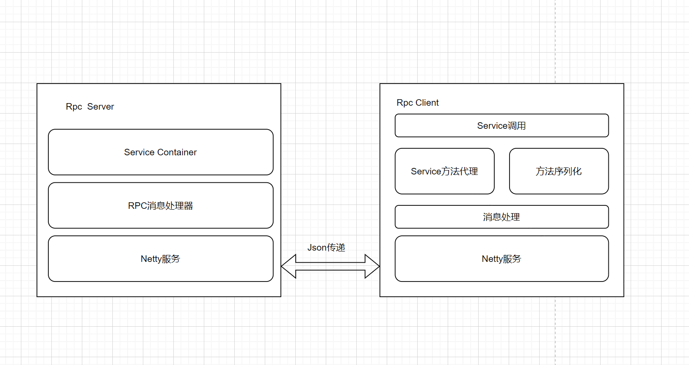
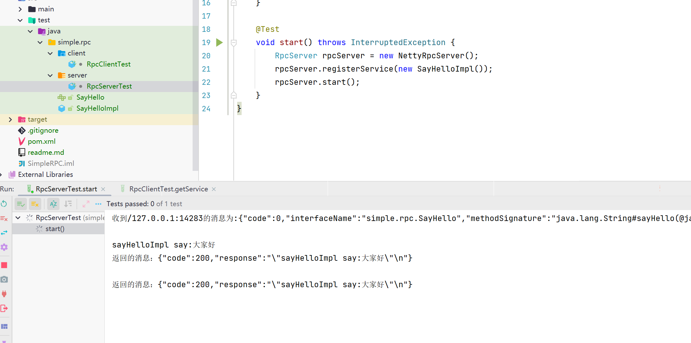
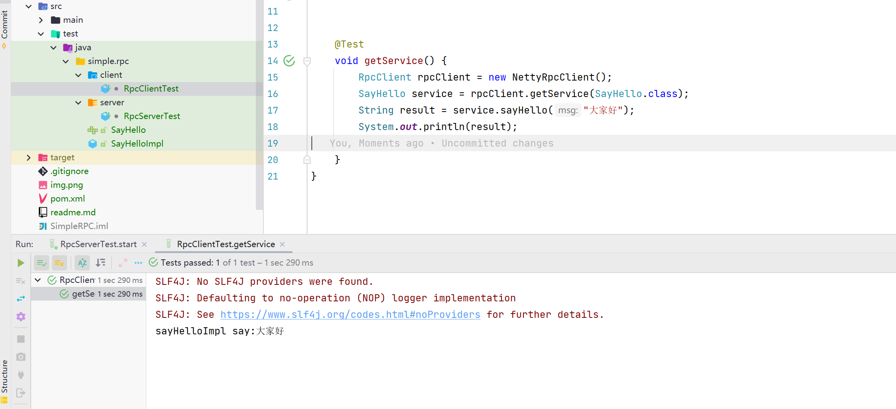

## SimpleRPC

### 实现原理

实现该功能最核心的莫过于服务调用端的方法代理和服务提供端与服务调用端的报文格式设计

### 大致流程

**client端**
1. 根据RpcCl**ient创建某个接口的代理类
2. 调用接口的方法
3. 生成当前方法的签名和调用参数等信息,并将其组装为固定格式的Json
4. 向RpcServer发送前面组装好的报文
5. 解析RpcServer返回的报文
6. 将RpcServer中方法的返回值返回给接口方法调用者

**server端**
1. 注册一个接口的具体实现
2. 接收并解析远端发送的执行接口方法的请求报文
3. 根据报文中的传参运行具体的方法
4. 将方法返回值返回给远端

### 测试截图：
服务提供方

服务调用方
